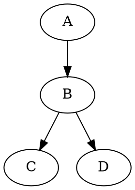

Markdown 문법 가이드
====================

Hackers' Pub에서는 게시물 작성 시 [Markdown] 문법을 사용할 수 있습니다.
이 문서는 [기본 Markdown 문법](#기본-서식)과 Hackers' Pub에서 제공하는
[확장 문법](#확장-문법)에 대한 설명입니다.

[Markdown]: https://commonmark.org/


기본 서식
---------

### 문단과 줄바꿈

Markdown에서 문단은 하나 이상의 빈 줄로 구분됩니다. 단순히 <kbd>Enter</kbd> 한 번으로 줄바꿈을 해도 렌더링 시에는 무시됩니다.

~~~~ markdown
이것은 첫 번째 문단입니다.
이 줄은 <kbd>Enter</kbd>를 한 번 쳤지만, 같은 문단으로 렌더링됩니다.

이것은 빈 줄 후에 작성된 두 번째 문단입니다.
~~~~

미리보기:

> 이것은 첫 번째 문단입니다.
> 이 줄은 <kbd>Enter</kbd>를 한 번 쳤지만, 같은 문단으로 렌더링됩니다.
>
> 이것은 빈 줄 후에 작성된 두 번째 문단입니다.

줄바꿈을 강제로 하려면 줄 끝에 공백 두 개 이상을 추가합니다:

~~~~ markdown
이 줄 끝에 공백 두 개를 추가하면  
줄바꿈이 적용됩니다.
~~~~

미리보기:

> 이 줄 끝에 공백 두 개를 추가하면  
> 줄바꿈이 적용됩니다.

### 제목

#### ATX 스타일 제목

ATX 스타일 제목은 `#` 기호로 시작하며, 단계에 따라 `#`의 개수가 달라집니다:

~~~~ markdown
# 제목 1
## 제목 2
### 제목 3
#### 제목 4
##### 제목 5
###### 제목 6
~~~~

#### Setext 스타일 제목

Setext 스타일 제목은 텍스트 아래에 `=` 또는 `-` 기호를 사용하여 표시합니다. 이 방식은 1단계와 2단계 제목만 지원합니다:

~~~~ markdown
제목 1
======

제목 2
------
~~~~

### 텍스트 강조

텍스트 강조는 다음과 같이 할 수 있습니다:

~~~~ markdown
*이탤릭* 또는 _이탤릭_  
**굵게** 또는 __굵게__  
***굵게 이탤릭*** 또는 ___굵게 이탤릭___
~~~~

미리보기:

> *이탤릭* 또는 _이탤릭_  
> **굵게** 또는 __굵게__  
> ***굵게 이탤릭*** 또는 ___굵게 이탤릭___

### 수평선

수평선은 세 개 이상의 하이픈(`-`), 별표(`*`) 또는 밑줄(`_`)을 사용하여 만들 수 있습니다:

~~~~ markdown
---

중략

***

중략

___
~~~~

미리보기:

> ---
>
> 중략
>
> ***
>
> 중략
>
> ___

### 링크

#### 인라인 스타일 링크

인라인 스타일 링크는 다음과 같이 작성합니다:

```markdown
[링크 텍스트](https://example.com/)
[링크 텍스트](https://example.com/ "링크 제목")
```

미리보기:

> [링크 텍스트](https://example.com/)  
> [링크 텍스트](https://example.com/ "링크 제목")

#### 참조 스타일 링크

참조 스타일 링크는 문서 어딘가에 URL을 정의하고 이를 참조합니다:

```markdown
[링크 텍스트][1]
[다른 링크][참조 이름]

[1]: https://example.com/
[참조 이름]: https://example.com/reference "링크 제목"
```

미리보기:

> [링크 텍스트][1]  
> [다른 링크][참조 이름]
>
> [1]: https://example.com/
> [참조 이름]: https://example.com/reference "링크 제목"

#### URL 링크

또한, `<`와 `>`로 URL을 감싸면 자동으로 링크로 변환됩니다: <https://example.com/>.

### 이미지

이미지 문법은 링크와 유사하지만 앞에 느낌표를 붙입니다. 대괄호 안의 텍스트는 시각 장애인을 위한 대체 텍스트(`alt`)로 사용됩니다.

#### 인라인 스타일 이미지

~~~~ markdown


~~~~

#### 참조 스타일 이미지

참조 스타일 이미지도 링크와 유사하게 사용할 수 있습니다:

~~~~ markdown
![대체 텍스트][이미지 ID]

[이미지 ID]: 이미지_URL "이미지 제목"
~~~~

### 목록

순서 없는 목록은 `*`, `+`, `-` 중 하나로 시작합니다:

~~~~ markdown
* 항목 1
* 항목 2
  * 중첩 항목 a
  * 중첩 항목 b
~~~~

미리보기:

> * 항목 1
> * 항목 2
>   * 중첩 항목 a
>   * 중첩 항목 b

순서 있는 목록은 숫자와 점으로 시작합니다:

~~~~ markdown
1. 첫 번째 항목
2. 두 번째 항목
   1. 중첩 항목 1
   2. 중첩 항목 2
~~~~

미리보기:

> 1. 첫 번째 항목
> 2. 두 번째 항목
>    1. 중첩 항목 1
>    2. 중첩 항목 2

### 인용

인용은 `>` 기호를 사용합니다. 인용은 중첩될 수 있습니다:

~~~~ markdown
> 인용문입니다.
> 여러 줄에 걸쳐 작성할 수 있습니다.
>
> 빈 줄을 포함하려면 `>`만 있는 줄을 추가합니다.
>
> > 인용문 안에 인용문을 중첩할 수 있습니다.
> >
> > > 여러 단계로 중첩도 가능합니다.
~~~~

미리보기:

> 인용문입니다.
> 여러 줄에 걸쳐 작성할 수 있습니다.
>
> 빈 줄을 포함하려면 `>`만 있는 줄을 추가합니다.
>
> > 인용문 안에 인용문을 중첩할 수 있습니다.
> >
> > > 여러 단계로 중첩도 가능합니다.

### 코드

인라인 코드는 백틱(`)으로 감싸줍니다:

~~~~ markdown
문장 중간에 `code`를 넣을 수 있습니다.
~~~~

미리보기:

> 문장 중간에 `code`를 넣을 수 있습니다.

백틱을 포함한 코드를 표시하려면 더 많은 백틱으로 감싸거나 다른 방법을 사용합니다:

~~~~ markdown
`` `백틱을 포함한 코드` ``
```
백틱 세 개 ```를 포함한 코드 블록
```
~~~~

미리보기:

> `` `백틱을 포함한 코드` ``
>
> ```
> 백틱 세 개 ```를 포함한 코드 블록
> ```

코드 블록은 세 개의 백틱으로 시작하고 끝냅니다. 언어를 지정하면 문법 강조가 적용됩니다:

~~~~ markdown
``` python
def hello_world():
    print("Hello, World!")
```
~~~~

미리보기:

> ``` python
> def hello_world():
>     print("Hello, World!")
> ```


확장 문법
---------

Hackers' Pub는 기본 Markdown 외에도 다양한 확장 문법을 지원합니다.

### 언급

사용자를 언급하려면 `@` 기호와 사용자 핸들을 함께 사용합니다:

~~~~ markdown
@hongminhee
@hongminhee@hackers.pub
~~~~

미리보기:

> @hongminhee  
> @hongminhee@hackers.pub

### 각주

각주는 다음과 같이 작성합니다:

~~~~ markdown
텍스트에 각주[^1]를 추가할 수 있습니다.

[^1]: 각주 내용입니다.
~~~~

미리보기:

> 텍스트에 각주[^1]를 추가할 수 있습니다.
>
> [^1]: 각주 내용입니다.

### 경고 박스 (admonitions)

GitHub 스타일의 경고 박스를 사용할 수 있습니다:

~~~~ markdown
> [!NOTE]
> 참고 사항입니다.

> [!WARNING]
> 경고 메시지입니다.

> [!TIP]
> 유용한 팁입니다.

> [!IMPORTANT]
> 중요한 정보입니다.

> [!CAUTION]
> 주의가 필요한 내용입니다.
~~~~

미리보기:

> [!NOTE]
> 참고 사항입니다.

> [!WARNING]
> 경고 메시지입니다.

> [!TIP]
> 유용한 팁입니다.

> [!IMPORTANT]
> 중요한 정보입니다.

> [!CAUTION]
> 주의가 필요한 내용입니다.

`[!…]` 뒤에 레이블을 붙이면 레이블이 변경됩니다:

~~~~ markdown
> [!TIP] 팁
> 이건 팁입니다.
~~~~

미리보기:

> [!TIP] 팁
> 이건 팁입니다.

### 정의 목록

정의 목록은 다음과 같이 작성합니다:

~~~~ markdown
용어
:   정의 내용

다른 용어
:   다른 정의 내용
~~~~

미리보기:

> 용어
> :   정의 내용
>
> 다른 용어
> :   다른 정의 내용

### 수식

TeX 문법을 사용하여 수식을 작성할 수 있습니다:

~~~~ markdown
인라인 수식: $E = mc^2$
~~~~

미리보기:

> 인라인 수식: $E = mc^2$

블록 수식:

~~~~ markdown
$$
\frac{n!}{k!(n-k)!} = \binom{n}{k}
$$
~~~~

미리보기:

> $$
> \frac{n!}{k!(n-k)!} = \binom{n}{k}
> $$

### 약어

약어와 그 의미를 정의할 수 있습니다:

~~~~ markdown
*[HTML]: HyperText Markup Language
*[W3C]: World Wide Web Consortium

HTML 문서는 W3C 표준을 따릅니다.
~~~~

미리보기:

> *[HTML]: HyperText Markup Language
> *[W3C]: World Wide Web Consortium
>
> HTML 문서는 W3C 표준을 따릅니다.

### 표

표는 파이프(`|`) 기호를 사용하여 작성합니다:

~~~~ markdown
| 헤더 1 | 헤더 2 |
|--------|--------|
| 값 1   | 값 2   |
| 값 3   | 값 4   |
| 값 5   | 값 6   |
~~~~

미리보기:

> | 헤더 1 | 헤더 2 |
> |--------|--------|
> | 값 1   | 값 2   |
> | 값 3   | 값 4   |
> | 값 5   | 값 6   |

> [!TIP] 팁
> [Markdown Table Generator]를 사용하면 쉽게 표를 생성할 수 있습니다.

[Markdown Table Generator]: https://www.tablesgenerator.com/markdown_tables

### 도표

[Graphviz]를 사용하여 도표를 그릴 수 있습니다:

~~~~ markdown

~~~~

미리보기:

> ```graphviz
> digraph {
>     A -> B -> C;
>     B -> D;
> }
> ```

> [!TIP] 팁
> [Graphviz Visual Editor]를 사용하면 도표를 시각적으로 편집할 수 있습니다.

[Graphviz]: https://graphviz.org/
[Graphviz Visual Editor]: https://magjac.com/graphviz-visual-editor/

### 코드 하이라이트

코드 블록에서 특정 줄이나 텍스트를 강조할 수 있습니다. 다양한 방법으로 코드를 강조할 수 있습니다:

#### 줄 번호로 강조

~~~~ markdown {1}
```js {3-4}
function example() {
  // 일반 코드
  // 이 줄은 강조됨
  // 이 줄도 강조됨
  return true;
}
```
~~~~

미리보기:

> ```js {3-4}
> function example() {
>   // 일반 코드
>   // 이 줄은 강조됨
>   // 이 줄도 강조됨
>   return true;
> }
> ```

#### 인라인 주석으로 강조

~~~~ markdown {3}
```js
function example() {
  const highlighted = "이 줄은 강조됨"; // [\!code highlight]
  return true;
}
```
~~~~

미리보기:

> ```js
> function example() {
>   const highlighted = "이 줄은 강조됨"; // [!code highlight]
>   return true;
> }
> ```

오류나 경고를 강조할 수도 있습니다:

~~~~ markdown {3-4}
```js
function example() {
  throwError(); // [\!code error]
  logWarning(); // [\!code warning]
}
```
~~~~

미리보기:

> ```js
> function example() {
>   throwError(); // [!code error]
>   logWarning(); // [!code warning]
> }
> ```

#### 인라인 주석으로 포커스

~~~~ markdown {3}
```js
function example() {
  const focused = "이 줄은 포커스됨"; // [\!code focus]
  return true;
}
```
~~~~

미리보기:

> ```js
> function example() {
>   const focused = "이 줄은 포커스됨"; // [!code focus]
>   return true;
> }
> ```

#### 정규식 패턴으로 특정 텍스트 강조

~~~~ markdown {1}
```js /강조할 텍스트/
const message = "이 줄에서 '강조할 텍스트'가 강조됩니다";
```
~~~~

미리보기:

> ```js /강조할 텍스트/
> const message = "이 줄에서 '강조할 텍스트'가 강조됩니다";
> ```

#### 인라인 주석으로 특정 텍스트 강조

~~~~ markdown {2}
```js
// [\!code word:강조할텍스트]
const message = "이 줄에서 '강조할텍스트'가 강조됩니다";
```
~~~~

미리보기:

> ```js
> // [!code word:강조할텍스트]
> const message = "이 줄에서 '강조할텍스트'가 강조됩니다";
> ```

### HTML 태그

Markdown 문서 내에서 HTML 태그를 사용할 수 있습니다. 예를 들어, `<kbd>` 태그를 사용하여 키보드 입력을 강조할 수 있습니다:

~~~~ markdown
<kbd>Ctrl</kbd> + <kbd>C</kbd>
~~~~

미리보기:

> <kbd>Ctrl</kbd> + <kbd>C</kbd>


팁
--

- Markdown에서는 일반 텍스트로 작성하고, 서식은 특수 문자로 표시합니다.
- 문단은 빈 줄로 구분됩니다. 단순히 <kbd>Enter</kbd> 한 번 치는 것은 무시됩니다.
- 줄바꿈을 강제로 하려면 줄 끝에 공백 두 개 이상을 추가합니다.
- 에디터에서 미리보기를 확인하여 원하는 형식으로 표시되는지 확인하세요.
- Markdown은 HTML을 직접 사용할 수도 있지만, 가능한 Markdown 문법을 사용하는 것이 좋습니다.


소스 코드
---------

Hackers' Pub의 Markdown의 구체적인 동작을 알고 싶은 분은, [소스 코드]를 확인하셔도 좋습니다.

[소스 코드]: https://github.com/hackers-pub/hackerspub/blob/main/models/markup.ts