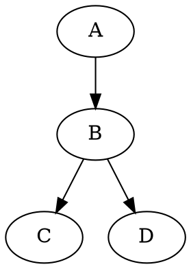

Markdown 语法指南
=================

在 Hackers' Pub 中，您可以在撰写帖子时使用 [Markdown] 语法。
本文档介绍了[基本 Markdown 语法](#基本格式)和
Hackers' Pub 提供的[扩展语法](#扩展语法)。

[Markdown]: https://commonmark.org/


基本格式
--------

### 段落和换行

在 Markdown 中，段落由一个或多个空白行分隔。如果只按一次 <kbd>Enter</kbd> 换行，在渲染时会被忽略。

~~~~ markdown
这是第一个段落。
这行在按了一次 <kbd>Enter</kbd> 后，但会被渲染为同一段落的一部分。

这是在空白行后写的第二个段落。
~~~~

预览：

> 这是第一个段落。
> 这行在按了一次 <kbd>Enter</kbd> 后，但会被渲染为同一段落的一部分。
>
> 这是在空白行后写的第二个段落。

要强制换行，请在行尾添加两个或更多空格：

~~~~ markdown
这行末尾有两个空格  
所以应用了换行。
~~~~

预览：

> 这行末尾有两个空格  
> 所以应用了换行。

### 标题

#### ATX 风格标题

ATX 风格标题以 `#` 符号开始，根据级别不同，`#` 的数量也不同：

~~~~ markdown
# 一级标题
## 二级标题
### 三级标题
#### 四级标题
##### 五级标题
###### 六级标题
~~~~

#### Setext 风格标题

Setext 风格标题在文本下方使用 `=` 或 `-` 符号。这种风格只支持一级和二级标题：

~~~~ markdown
一级标题
======

二级标题
------
~~~~

### 文本强调

您可以通过以下方式强调文本：

~~~~ markdown
*斜体* 或 _斜体_  
**粗体** 或 __粗体__  
***粗斜体*** 或 ___粗斜体___
~~~~

预览：

> *斜体* 或 _斜体_  
> **粗体** 或 __粗体__  
> ***粗斜体*** 或 ___粗斜体___

### 水平线

水平线可以使用三个或更多的连字符(`-`)、星号(`*`)或下划线(`_`)创建：

~~~~ markdown
---

内容省略

***

内容省略

___
~~~~

预览：

> ---
>
> 内容省略
>
> ***
>
> 内容省略
>
> ___

### 链接

#### 内联风格链接

内联风格链接的写法如下：

```markdown
[链接文本](https://example.com/)
[链接文本](https://example.com/ "链接标题")
```

预览：

> [链接文本](https://example.com/)  
> [链接文本](https://example.com/ "链接标题")

#### 引用风格链接

引用风格链接在文档的某处定义 URL 并引用它：

```markdown
[链接文本][1]
[另一个链接][引用名称]

[1]: https://example.com/
[引用名称]: https://example.com/reference "链接标题"
```

预览：

> [链接文本][1]  
> [另一个链接][引用名称]
>
> [1]: https://example.com/
> [引用名称]: https://example.com/reference "链接标题"

#### URL 链接

此外，用 `<` 和 `>` 包围的 URL 会自动转换为链接：<https://example.com/>。

### 图片

图片语法类似于链接，但前面有一个感叹号。方括号中的文本用作屏幕阅读器和无障碍功能的替代文本（`alt`）。

#### 内联风格图片

~~~~ markdown


~~~~

#### 引用风格图片

引用风格图片可以类似于引用风格链接使用：

~~~~ markdown
![替代文本][图片ID]

[图片ID]: 图片_URL "图片标题"
~~~~

### 列表

无序列表以 `*`、`+` 或 `-` 开始：

~~~~ markdown
* 项目1
* 项目2
  * 嵌套项目a
  * 嵌套项目b
~~~~

预览：

> * 项目1
> * 项目2
>   * 嵌套项目a
>   * 嵌套项目b

有序列表以数字和句点开始：

~~~~ markdown
1. 第一项
2. 第二项
   1. 嵌套项目1
   2. 嵌套项目2
~~~~

预览：

> 1. 第一项
> 2. 第二项
>    1. 嵌套项目1
>    2. 嵌套项目2

### 引用块

引用块使用 `>` 符号。引用块可以嵌套：

~~~~ markdown
> 这是一个引用块。
> 它可以跨多行书写。
>
> 要包含空白行，请添加只有 `>` 的行。
>
> > 引用块中可以嵌套引用块。
> >
> > > 可以进行多级嵌套。
~~~~

预览：

> 这是一个引用块。
> 它可以跨多行书写。
>
> 要包含空白行，请添加只有 `>` 的行。
>
> > 引用块中可以嵌套引用块。
> >
> > > 可以进行多级嵌套。

### 代码

内联代码用反引号(`)包围：

~~~~ markdown
您可以在句子中包含`代码`。
~~~~

预览：

> 您可以在句子中包含`代码`。

要显示包含反引号的代码，请用更多反引号包围或使用其他方法：

~~~~ markdown
`` `包含反引号的代码` ``
```
包含三个反引号 ```的代码块
```
~~~~

预览：

> `` `包含反引号的代码` ``
>
> ```
> 包含三个反引号 ```的代码块
> ```

代码块以三个反引号开始和结束。指定语言可以启用语法高亮：

~~~~ markdown
``` python
def hello_world():
    print("Hello, World!")
```
~~~~

预览：

> ``` python
> def hello_world():
>     print("Hello, World!")
> ```


扩展语法
--------

Hackers' Pub 支持多种基本 Markdown 之外的扩展语法。

### 提及用户

要提及用户，请使用 `@` 符号和用户的标识：

~~~~ markdown
@hongminhee
@hongminhee@hackers.pub
~~~~

预览：

> @hongminhee  
> @hongminhee@hackers.pub

### 脚注

脚注的书写方式如下：

~~~~ markdown
带有脚注的文本[^1]。

[^1]: 这是脚注内容。
~~~~

预览：

> 带有脚注的文本[^1]。
>
> [^1]: 这是脚注内容。

### 提示框（admonitions）

可以使用 GitHub 风格的提示框：

~~~~ markdown
> [!NOTE]
> 这是一个注释。

> [!WARNING]
> 这是一个警告信息。

> [!TIP]
> 这是一个有用的提示。

> [!IMPORTANT]
> 这是重要信息。

> [!CAUTION]
> 这需要注意。
~~~~

预览：

> [!NOTE]
> 这是一个注释。

> [!WARNING]
> 这是一个警告信息。

> [!TIP]
> 这是一个有用的提示。

> [!IMPORTANT]
> 这是重要信息。

> [!CAUTION]
> 这需要注意。

您可以通过在 `[!…]` 后添加文本来更改标签：

~~~~ markdown
> [!TIP] 提示
> 这是一个提示。
~~~~

预览：

> [!TIP] 提示
> 这是一个提示。

### 定义列表

定义列表的书写方式如下：

~~~~ markdown
术语
:   定义内容

另一个术语
:   另一个定义内容
~~~~

预览：

> 术语
> :   定义内容
>
> 另一个术语
> :   另一个定义内容

### 数学表达式

您可以使用 TeX 语法编写数学表达式：

~~~~ markdown
内联数学：$E = mc^2$
~~~~

预览：

> 内联数学：$E = mc^2$

块级数学：

~~~~ markdown
$$
\frac{n!}{k!(n-k)!} = \binom{n}{k}
$$
~~~~

预览：

> $$
> \frac{n!}{k!(n-k)!} = \binom{n}{k}
> $$

### 缩写

您可以定义缩写及其含义：

~~~~ markdown
*[HTML]: HyperText Markup Language
*[W3C]: World Wide Web Consortium

HTML 文档遵循 W3C 标准。
~~~~

预览：

> *[HTML]: HyperText Markup Language
> *[W3C]: World Wide Web Consortium
>
> HTML 文档遵循 W3C 标准。

### 表格

表格使用管道（`|`）字符创建：

~~~~ markdown
| 表头1  | 表头2  |
|-------|-------|
| 值1   | 值2   |
| 值3   | 值4   |
| 值5   | 值6   |
~~~~

预览：

> | 表头1  | 表头2  |
> |-------|-------|
> | 值1   | 值2   |
> | 值3   | 值4   |
> | 值5   | 值6   |

> [!TIP] 提示
> 您可以使用 [Markdown Table Generator] 轻松创建表格。

[Markdown Table Generator]: https://www.tablesgenerator.com/markdown_tables

### 图表

您可以使用 [Graphviz] 绘制图表：

~~~~ markdown

~~~~

预览：

> ```graphviz
> digraph {
>     A -> B -> C;
>     B -> D;
> }
> ```

> [!TIP] 提示
> 您可以使用 [Graphviz Visual Editor] 可视化编辑图表。

[Graphviz]: https://graphviz.org/
[Graphviz Visual Editor]: https://magjac.com/graphviz-visual-editor/

### 代码高亮

您可以通过多种方式在代码块中高亮特定行或文本：

#### 使用行号高亮

~~~~ markdown {1}
```js {3-4}
function example() {
  // 普通代码
  // 这行被高亮
  // 这行也被高亮
  return true;
}
```
~~~~

预览：

> ```js {3-4}
> function example() {
>   // 普通代码
>   // 这行被高亮
>   // 这行也被高亮
>   return true;
> }
> ```

#### 使用内联注释高亮

~~~~ markdown {3}
```js
function example() {
  const highlighted = "这行被高亮"; // [\!code highlight]
  return true;
}
```
~~~~

预览：

> ```js
> function example() {
>   const highlighted = "这行被高亮"; // [!code highlight]
>   return true;
> }
> ```

您还可以高亮错误或警告：

~~~~ markdown {3-4}
```js
function example() {
  throwError(); // [\!code error]
  logWarning(); // [\!code warning]
}
```
~~~~

预览：

> ```js
> function example() {
>   throwError(); // [!code error]
>   logWarning(); // [!code warning]
> }
> ```

#### 使用内联注释聚焦

~~~~ markdown {3}
```js
function example() {
  const focused = "这行被聚焦"; // [\!code focus]
  return true;
}
```
~~~~

预览：

> ```js
> function example() {
>   const focused = "这行被聚焦"; // [!code focus]
>   return true;
> }
> ```

#### 使用正则表达式模式高亮特定文本

~~~~ markdown {1}
```js /要高亮的文本/
const message = "在这行中，'要高亮的文本'将被高亮";
```
~~~~

预览：

> ```js /要高亮的文本/
> const message = "在这行中，'要高亮的文本'将被高亮";
> ```

#### 使用内联注释高亮特定文本

~~~~ markdown {2}
```js
// [\!code word:高亮文本]
const message = "在这行中，'高亮文本'将被高亮";
```
~~~~

预览：

> ```js
> // [!code word:高亮文本]
> const message = "在这行中，'高亮文本'将被高亮";
> ```

### HTML 标签

您可以在 Markdown 文档中使用 HTML 标签。例如，您可以使用 `<kbd>` 标签来突出显示键盘输入：

~~~~ markdown
<kbd>Ctrl</kbd> + <kbd>C</kbd>
~~~~

预览：

> <kbd>Ctrl</kbd> + <kbd>C</kbd>

## 提示

- 在 Markdown 中，使用纯文本编写，并使用特殊字符进行格式化。
- 段落由空白行分隔。单次按 <kbd>Enter</kbd> 键会被忽略。
- 要强制换行，请在行尾添加两个或更多空格。
- 在编辑器中检查预览，确保它按预期显示。
- 虽然 Markdown 支持直接使用 HTML，但最好尽可能使用 Markdown 语法。
