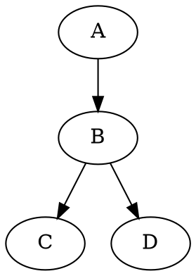

Markdown 語法指南
=====================

在 Hackers' Pub 中，你可以在寫貼文時使用 [Markdown] 語法。
本文檔說明了[基本 Markdown 語法](#基本格式)和
Hackers' Pub 提供的[擴展語法](#擴展語法)。

[Markdown]: https://commonmark.org/


基本格式
----------------

### 段落和換行

在 Markdown 中，段落由一個或多個空行分隔。如果你只是按一次 <kbd>Enter</kbd> 來換行，在渲染時它會被忽略。

~~~~ markdown
這是第一段。
這行在它之後有一個單獨的 <kbd>Enter</kbd>，但它會被渲染為同一段落的一部分。

這是第二段，在空行後寫的。
~~~~

預覽：

> 這是第一段。
> 這行在它之後有一個單獨的 <kbd>Enter</kbd>，但它會被渲染為同一段落的一部分。
>
> 這是第二段，在空行後寫的。

要強制換行，在行尾添加兩個或更多空格：

~~~~ markdown
這行以兩個空格結尾  
所以會應用換行。
~~~~

預覽：

> 這行以兩個空格結尾  
> 所以會應用換行。

### 標題

#### ATX 風格標題

ATX 風格標題以 `#` 符號開始，`#` 字符的數量隨層級變化：

~~~~ markdown
# 標題 1
## 標題 2
### 標題 3
#### 標題 4
##### 標題 5
###### 標題 6
~~~~

#### Setext 風格標題

Setext 風格標題在文本下方使用 `=` 或 `-` 符號。此風格僅支援一級和二級標題：

~~~~ markdown
標題 1
======

標題 2
------
~~~~

### 文本強調

你可以通過以下方式強調文本：

~~~~ markdown
*斜體* 或 _斜體_  
**粗體** 或 __粗體__  
***粗斜體*** 或 ___粗斜體___
~~~~

預覽：

> *斜體* 或 _斜體_  
> **粗體** 或 __粗體__  
> ***粗斜體*** 或 ___粗斜體___

### 水平線

水平線可以使用三個或更多連字符（`-`）、星號（`*`）或底線（`_`）創建：

~~~~ markdown
---

內容省略

***

內容省略

___
~~~~

預覽：

> ---
>
> 內容省略
>
> ***
>
> 內容省略
>
> ___

### 連結

#### 內聯樣式連結

內聯樣式連結的寫法如下：

```markdown
[連結文本](https://example.com/)
[連結文本](https://example.com/ "連結標題")
```

預覽：

> [連結文本](https://example.com/)  
> [連結文本](https://example.com/ "連結標題")

#### 參考樣式連結

參考樣式連結在文檔的某處定義 URL 並引用它：

```markdown
[連結文本][1]
[另一個連結][參考名稱]

[1]: https://example.com/
[參考名稱]: https://example.com/reference "連結標題"
```

預覽：

> [連結文本][1]  
> [另一個連結][參考名稱]
>
> [1]: https://example.com/
> [參考名稱]: https://example.com/reference "連結標題"

#### URL 連結

此外，用 `<` 和 `>` 括起來的 URL 會自動轉換為連結：<https://example.com/>。

### 圖片

圖片語法類似連結，但在開頭有一個感嘆號。方括號中的文本用作替代文本（`alt`），為螢幕閱讀器和可訪問性提供支援。

#### 內聯樣式圖片

~~~~ markdown


~~~~

#### 參考樣式圖片

參考樣式圖片可以類似於參考樣式連結使用：

~~~~ markdown
![替代文本][圖片ID]

[圖片ID]: 圖片URL "圖片標題"
~~~~

### 列表

無序列表以 `*`、`+` 或 `-` 開始：

~~~~ markdown
* 項目 1
* 項目 2
  * 嵌套項目 a
  * 嵌套項目 b
~~~~

預覽：

> * 項目 1
> * 項目 2
>   * 嵌套項目 a
>   * 嵌套項目 b

有序列表以數字和句點開始：

~~~~ markdown
1. 第一項
2. 第二項
   1. 嵌套項目 1
   2. 嵌套項目 2
~~~~

預覽：

> 1. 第一項
> 2. 第二項
>    1. 嵌套項目 1
>    2. 嵌套項目 2

### 引用區塊

引用區塊使用 `>` 符號。引用區塊可以嵌套：

~~~~ markdown
> 這是一個引用區塊。
> 它可以跨越多行。
>
> 包含一個只有 `>` 的空行以添加空白行。
>
> > 引用區塊可以在引用區塊中嵌套。
> >
> > > 可以進行多層嵌套。
~~~~

預覽：

> 這是一個引用區塊。
> 它可以跨越多行。
>
> 包含一個只有 `>` 的空行以添加空白行。
>
> > 引用區塊可以在引用區塊中嵌套。
> >
> > > 可以進行多層嵌套。

### 程式碼

內聯程式碼用反引號（`）包裝：

~~~~ markdown
你可以在句子中包含 `程式碼`。
~~~~

預覽：

> 你可以在句子中包含 `程式碼`。

要顯示包含反引號的程式碼，用更多反引號包裹它或使用其他方法：

~~~~ markdown
`` `包含反引號的程式碼` ``
```
包含三重反引號的程式碼塊 ```
```
~~~~

預覽：

> `` `包含反引號的程式碼` ``
>
> ```
> 包含三重反引號的程式碼塊 ```
> ```

程式碼塊以三個反引號開始和結束。指定語言可啟用語法高亮：

~~~~ markdown
``` python
def hello_world():
    print("Hello, World!")
```
~~~~

預覽：

> ``` python
> def hello_world():
>     print("Hello, World!")
> ```


擴展語法
---------------

Hackers' Pub 支援基本功能之外的各種擴展 Markdown 語法。

### 提及

要提及使用者，使用 `@` 符號和使用者的 handle：

~~~~ markdown
@hongminhee
@hongminhee@hackers.pub
~~~~

預覽：

> @hongminhee  
> @hongminhee@hackers.pub

### 腳註

腳註的寫法如下：

~~~~ markdown
帶有腳註的文本[^1]。

[^1]: 這是腳註內容。
~~~~

預覽：

> 帶有腳註的文本[^1]。
>
> [^1]: 這是腳註內容。

### 告示框

可以使用 GitHub 風格的告示框：

~~~~ markdown
> [!NOTE]
> 這是一個注意事項。

> [!WARNING]
> 這是一個警告訊息。

> [!TIP]
> 這是一個有用的提示。

> [!IMPORTANT]
> 這是重要信息。

> [!CAUTION]
> 這需要謹慎。
~~~~

預覽：

> [!NOTE]
> 這是一個注意事項。

> [!WARNING]
> 這是一個警告訊息。

> [!TIP]
> 這是一個有用的提示。

> [!IMPORTANT]
> 這是重要信息。

> [!CAUTION]
> 這需要謹慎。

你可以透過在 `[!…]` 後添加文本來更改標籤：

~~~~ markdown
> [!TIP] 資訊
> 這是一條資訊。
~~~~

預覽：

> [!TIP] 資訊
> 這是一條資訊。

### 定義列表

定義列表的寫法如下：

~~~~ markdown
術語
:   定義內容

另一個術語
:   另一個定義內容
~~~~

預覽：

> 術語
> :   定義內容
>
> 另一個術語
> :   另一個定義內容

### 數學表達式

你可以使用 TeX 語法編寫數學表達式：

~~~~ markdown
內聯數學：$E = mc^2$
~~~~

預覽：

> 內聯數學：$E = mc^2$

區塊數學：

~~~~ markdown
$$
\frac{n!}{k!(n-k)!} = \binom{n}{k}
$$
~~~~

預覽：

> $$
> \frac{n!}{k!(n-k)!} = \binom{n}{k}
> $$

### 縮寫

你可以定義縮寫及其含義：

~~~~ markdown
*[HTML]: 超文本標記語言
*[W3C]: 萬維網聯盟

HTML 文件遵循 W3C 標準。
~~~~

預覽：

> *[HTML]: 超文本標記語言
> *[W3C]: 萬維網聯盟
>
> HTML 文件遵循 W3C 標準。

### 表格

表格使用豎線（`|`）字符創建：

~~~~ markdown
| 標題 1 | 標題 2 |
|----------|----------|
| 值 1  | 值 2  |
| 值 3  | 值 4  |
| 值 5  | 值 6  |
~~~~

預覽：

> | 標題 1 | 標題 2 |
> |----------|----------|
> | 值 1  | 值 2  |
> | 值 3  | 值 4  |
> | 值 5  | 值 6  |

> [!TIP] 提示
> 你可以使用 [Markdown 表格生成器] 輕鬆創建表格。

[Markdown 表格生成器]: https://www.tablesgenerator.com/markdown_tables

### 圖表

你可以使用 [Graphviz] 繪製圖表：

~~~~ markdown

~~~~

預覽：

> ```graphviz
> digraph {
>     A -> B -> C;
>     B -> D;
> }
> ```

> [!TIP] 提示
> 你可以使用 [Graphviz 視覺編輯器] 視覺化編輯圖表。

[Graphviz]: https://graphviz.org/
[Graphviz 視覺編輯器]: https://magjac.com/graphviz-visual-editor/

### 程式碼高亮

你可以以各種方式在程式碼塊中高亮特定行或文本：

#### 使用行號高亮

~~~~ markdown {1}
```js {3-4}
function example() {
  // 普通程式碼
  // 這行被高亮
  // 這行也被高亮
  return true;
}
```
~~~~

預覽：

> ```js {3-4}
> function example() {
>   // 普通程式碼
>   // 這行被高亮
>   // 這行也被高亮
>   return true;
> }
> ```

#### 使用內聯註釋高亮

~~~~ markdown {3}
```js
function example() {
  const highlighted = "這行被高亮"; // [\!code highlight]
  return true;
}
```
~~~~

預覽：

> ```js
> function example() {
>   const highlighted = "這行被高亮"; // [!code highlight]
>   return true;
> }
> ```

你還可以高亮錯誤或警告：

~~~~ markdown {3-4}
```js
function example() {
  throwError(); // [\!code error]
  logWarning(); // [\!code warning]
}
```
~~~~

預覽：

> ```js
> function example() {
>   throwError(); // [!code error]
>   logWarning(); // [!code warning]
> }
> ```

#### 使用內聯註釋聚焦

~~~~ markdown {3}
```js
function example() {
  const focused = "這行被聚焦"; // [\!code focus]
  return true;
}
```
~~~~

預覽：

> ```js
> function example() {
>   const focused = "這行被聚焦"; // [!code focus]
>   return true;
> }
> ```

#### 使用正則表達式模式高亮特定文本

~~~~ markdown {1}
```js /要高亮的文本/
const message = "在這行中，'要高亮的文本' 將被高亮";
```
~~~~

預覽：

> ```js /要高亮的文本/
> const message = "在這行中，'要高亮的文本' 將被高亮";
> ```

#### 使用內聯註釋高亮特定文本

~~~~ markdown {2}
```js
// [\!code word:highlightText]
const message = "在這行中，'highlightText' 將被高亮";
```
~~~~

預覽：

> ```js
> // [!code word:highlightText]
> const message = "在這行中，'highlightText' 將被高亮";
> ```

### HTML 標籤

你可以在 Markdown 文件中使用 HTML 標籤。例如，你可以使用 `<kbd>` 標籤來高亮鍵盤輸入：

~~~~ markdown
<kbd>Ctrl</kbd> + <kbd>C</kbd>
~~~~

預覽：

> <kbd>Ctrl</kbd> + <kbd>C</kbd>

## 提示

- 在 Markdown 中，以純文本撰寫並使用特殊字符進行格式化。
- 段落由空行分隔。單個 <kbd>Enter</kbd> 按鍵會被忽略。
- 要強制換行，在行尾添加兩個或更多空格。
- 在編輯器中檢查預覽，確保其按預期顯示。
- 雖然 Markdown 支援直接使用 HTML，但最好儘可能使用 Markdown 語法。