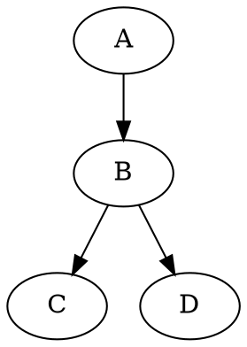

Markdown Syntax Guide
=====================

In Hackers' Pub, you can use [Markdown] syntax when writing posts.
This document explains [basic Markdown syntax](#basic-formatting) and
[extended syntax](#extended-syntax) provided by Hackers' Pub.

[Markdown]: https://commonmark.org/


Basic Formatting
----------------

### Paragraphs and Line Breaks

In Markdown, paragraphs are separated by one or more blank lines. If you simply press <kbd>Enter</kbd> once for a line break, it will be ignored when rendered.

~~~~ markdown
This is the first paragraph.
This line has a single <kbd>Enter</kbd> after it, but it will be rendered as part of the same paragraph.

This is the second paragraph, written after a blank line.
~~~~

Preview:

> This is the first paragraph.
> This line has a single <kbd>Enter</kbd> after it, but it will be rendered as part of the same paragraph.
>
> This is the second paragraph, written after a blank line.

To force a line break, add two or more spaces at the end of a line:

~~~~ markdown
This line ends with two spaces  
so a line break is applied.
~~~~

Preview:

> This line ends with two spaces  
> so a line break is applied.

### Headings

#### ATX Style Headings

ATX style headings start with the `#` symbol, with the number of `#` characters varying by level:

~~~~ markdown
# Heading 1
## Heading 2
### Heading 3
#### Heading 4
##### Heading 5
###### Heading 6
~~~~

#### Setext Style Headings

Setext style headings use `=` or `-` symbols under the text. This style only supports level 1 and level 2 headings:

~~~~ markdown
Heading 1
======

Heading 2
------
~~~~

### Text Emphasis

You can emphasize text in the following ways:

~~~~ markdown
*Italic* or _Italic_  
**Bold** or __Bold__  
***Bold Italic*** or ___Bold Italic___
~~~~

Preview:

> *Italic* or _Italic_  
> **Bold** or __Bold__  
> ***Bold Italic*** or ___Bold Italic___

### Horizontal Rules

Horizontal rules can be created using three or more hyphens (`-`), asterisks (`*`), or underscores (`_`):

~~~~ markdown
---

Content omitted

***

Content omitted

___
~~~~

Preview:

> ---
>
> Content omitted
>
> ***
>
> Content omitted
>
> ___

### Links

#### Inline Style Links

Inline style links are written as follows:

```markdown
[Link text](https://example.com/)
[Link text](https://example.com/ "Link title")
```

Preview:

> [Link text](https://example.com/)  
> [Link text](https://example.com/ "Link title")

#### Reference Style Links

Reference style links define the URL somewhere in the document and reference it:

```markdown
[Link text][1]
[Another link][reference name]

[1]: https://example.com/
[reference name]: https://example.com/reference "Link title"
```

Preview:

> [Link text][1]  
> [Another link][reference name]
>
> [1]: https://example.com/
> [reference name]: https://example.com/reference "Link title"

#### URL Links

Also, URLs enclosed in `<` and `>` are automatically converted to links: <https://example.com/>.

### Images

Image syntax is similar to links but with an exclamation mark at the beginning. The text in brackets is used as alternative text (`alt`) for screen readers and accessibility.

#### Inline Style Images

~~~~ markdown


~~~~

#### Reference Style Images

Reference style images can be used similarly to reference style links:

~~~~ markdown
![Alt text][image ID]

[image ID]: image_URL "Image title"
~~~~

### Lists

Unordered lists start with `*`, `+`, or `-`:

~~~~ markdown
* Item 1
* Item 2
  * Nested item a
  * Nested item b
~~~~

Preview:

> * Item 1
> * Item 2
>   * Nested item a
>   * Nested item b

Ordered lists start with a number and a period:

~~~~ markdown
1. First item
2. Second item
   1. Nested item 1
   2. Nested item 2
~~~~

Preview:

> 1. First item
> 2. Second item
>    1. Nested item 1
>    2. Nested item 2

### Blockquotes

Blockquotes use the `>` symbol. Blockquotes can be nested:

~~~~ markdown
> This is a blockquote.
> It can span multiple lines.
>
> Include an empty line with just `>` to include a blank line.
>
> > Blockquotes can be nested within blockquotes.
> >
> > > Multiple levels of nesting are possible.
~~~~

Preview:

> This is a blockquote.
> It can span multiple lines.
>
> Include an empty line with just `>` to include a blank line.
>
> > Blockquotes can be nested within blockquotes.
> >
> > > Multiple levels of nesting are possible.

### Code

Inline code is wrapped in backticks (`):

~~~~ markdown
You can include `code` within a sentence.
~~~~

Preview:

> You can include `code` within a sentence.

To display code containing backticks, wrap it in more backticks or use another method:

~~~~ markdown
`` `Code with backticks` ``
```
Code block with triple backticks ```
```
~~~~

Preview:

> `` `Code with backticks` ``
>
> ```
> Code block with triple backticks ```
> ```

Code blocks start and end with three backticks. Specifying a language enables syntax highlighting:

~~~~ markdown
``` python
def hello_world():
    print("Hello, World!")
```
~~~~

Preview:

> ``` python
> def hello_world():
>     print("Hello, World!")
> ```


Extended Syntax
---------------

Hackers' Pub supports various extended Markdown syntax beyond the basics.

### Mentions

To mention a user, use the `@` symbol with the user's handle:

~~~~ markdown
@hongminhee
@hongminhee@hackers.pub
~~~~

Preview:

> @hongminhee  
> @hongminhee@hackers.pub

### Footnotes

Footnotes are written as follows:

~~~~ markdown
Text with a footnote[^1].

[^1]: This is the footnote content.
~~~~

Preview:

> Text with a footnote[^1].
>
> [^1]: This is the footnote content.

### Admonitions

GitHub-style admonition boxes can be used:

~~~~ markdown
> [!NOTE]
> This is a note.

> [!WARNING]
> This is a warning message.

> [!TIP]
> This is a useful tip.

> [!IMPORTANT]
> This is important information.

> [!CAUTION]
> This requires caution.
~~~~

Preview:

> [!NOTE]
> This is a note.

> [!WARNING]
> This is a warning message.

> [!TIP]
> This is a useful tip.

> [!IMPORTANT]
> This is important information.

> [!CAUTION]
> This requires caution.

You can change the label by adding text after `[!…]`:

~~~~ markdown
> [!TIP] Info
> This is an info.
~~~~

Preview:

> [!TIP] Info
> This is an info.

### Definition Lists

Definition lists are written as follows:

~~~~ markdown
Term
:   Definition content

Another term
:   Another definition content
~~~~

Preview:

> Term
> :   Definition content
>
> Another term
> :   Another definition content

### Math Expressions

You can write mathematical expressions using TeX syntax:

~~~~ markdown
Inline math: $E = mc^2$
~~~~

Preview:

> Inline math: $E = mc^2$

Block math:

~~~~ markdown
$$
\frac{n!}{k!(n-k)!} = \binom{n}{k}
$$
~~~~

Preview:

> $$
> \frac{n!}{k!(n-k)!} = \binom{n}{k}
> $$

### Abbreviations

You can define abbreviations and their meanings:

~~~~ markdown
*[HTML]: HyperText Markup Language
*[W3C]: World Wide Web Consortium

HTML documents follow W3C standards.
~~~~

Preview:

> *[HTML]: HyperText Markup Language
> *[W3C]: World Wide Web Consortium
>
> HTML documents follow W3C standards.

### Tables

Tables are created using pipe (`|`) characters:

~~~~ markdown
| Header 1 | Header 2 |
|----------|----------|
| Value 1  | Value 2  |
| Value 3  | Value 4  |
| Value 5  | Value 6  |
~~~~

Preview:

> | Header 1 | Header 2 |
> |----------|----------|
> | Value 1  | Value 2  |
> | Value 3  | Value 4  |
> | Value 5  | Value 6  |

> [!TIP] Tip
> You can use [Markdown Table Generator] to easily create tables.

[Markdown Table Generator]: https://www.tablesgenerator.com/markdown_tables

### Diagrams

You can draw diagrams using [Graphviz]:

~~~~ markdown

~~~~

Preview:

> ```graphviz
> digraph {
>     A -> B -> C;
>     B -> D;
> }
> ```

> [!TIP] Tip
> You can edit diagrams visually using [Graphviz Visual Editor].

[Graphviz]: https://graphviz.org/
[Graphviz Visual Editor]: https://magjac.com/graphviz-visual-editor/

### Code Highlighting

You can highlight specific lines or text in code blocks in various ways:

#### Highlighting with Line Numbers

~~~~ markdown {1}
```js {3-4}
function example() {
  // Normal code
  // This line is highlighted
  // This line is also highlighted
  return true;
}
```
~~~~

Preview:

> ```js {3-4}
> function example() {
>   // Normal code
>   // This line is highlighted
>   // This line is also highlighted
>   return true;
> }
> ```

#### Highlighting with Inline Comments

~~~~ markdown {3}
```js
function example() {
  const highlighted = "This line is highlighted"; // [\!code highlight]
  return true;
}
```
~~~~

Preview:

> ```js
> function example() {
>   const highlighted = "This line is highlighted"; // [!code highlight]
>   return true;
> }
> ```

You can also highlight errors or warnings:

~~~~ markdown {3-4}
```js
function example() {
  throwError(); // [\!code error]
  logWarning(); // [\!code warning]
}
```
~~~~

Preview:

> ```js
> function example() {
>   throwError(); // [!code error]
>   logWarning(); // [!code warning]
> }
> ```

#### Focusing with Inline Comments

~~~~ markdown {3}
```js
function example() {
  const focused = "This line is focused"; // [\!code focus]
  return true;
}
```
~~~~

Preview:

> ```js
> function example() {
>   const focused = "This line is focused"; // [!code focus]
>   return true;
> }
> ```

#### Highlighting Specific Text with Regex Patterns

~~~~ markdown {1}
```js /text to highlight/
const message = "In this line, 'text to highlight' will be highlighted";
```
~~~~

Preview:

> ```js /text to highlight/
> const message = "In this line, 'text to highlight' will be highlighted";
> ```

#### Highlighting Specific Text with Inline Comments

~~~~ markdown {2}
```js
// [\!code word:highlightText]
const message = "In this line, 'highlightText' will be highlighted";
```
~~~~

Preview:

> ```js
> // [!code word:highlightText]
> const message = "In this line, 'highlightText' will be highlighted";
> ```

### HTML Tags

You can use HTML tags within Markdown documents. For example, you can use the `<kbd>` tag to highlight keyboard input:

~~~~ markdown
<kbd>Ctrl</kbd> + <kbd>C</kbd>
~~~~

Preview:

> <kbd>Ctrl</kbd> + <kbd>C</kbd>


Tips
----

- In Markdown, write in plain text and use special characters for formatting.
- Paragraphs are separated by blank lines. A single <kbd>Enter</kbd> press is ignored.
- To force a line break, add two or more spaces at the end of a line.
- Check the preview in the editor to ensure it displays as expected.
- While Markdown supports direct HTML usage, it's best to use Markdown syntax when possible.


Source Code
-----------

If you are interested in the specific behavior of Hackers' Pub's Markdown
implementation, feel free to check the [source code].

[source code]: https://github.com/hackers-pub/hackerspub/blob/main/models/markup.ts
