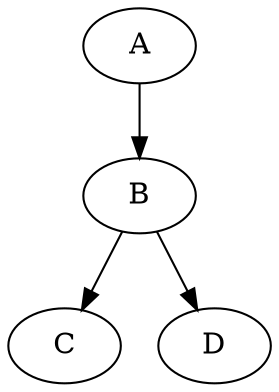

Markdown 構文ガイド
===================

Hackers' Pubでは、投稿を作成する際に[Markdown]構文を使用できます。
このドキュメントでは、[基本的なMarkdown構文](#基本的な書式)と
Hackers' Pubが提供する[拡張構文](#拡張構文)について説明します。

[Markdown]: https://commonmark.org/


基本的な書式
------------

### 段落と改行

Markdownでは、段落は1つ以上の空白行で区切られます。単に<kbd>Enter</kbd>キーを1回押して改行しても、レンダリング時には無視されます。

~~~~ markdown
これは最初の段落です。
この行は<kbd>Enter</kbd>を1回押した後ですが、同じ段落として表示されます。

これは空白行の後に書かれた2番目の段落です。
~~~~

プレビュー:

> これは最初の段落です。
> この行は<kbd>Enter</kbd>を1回押した後ですが、同じ段落として表示されます。
>
> これは空白行の後に書かれた2番目の段落です。

強制的に改行するには、行末に2つ以上のスペースを追加します:

~~~~ markdown
この行の末尾には2つのスペースがあるので  
改行が適用されます。
~~~~

プレビュー:

> この行の末尾には2つのスペースがあるので  
> 改行が適用されます。

### 見出し

#### ATXスタイルの見出し

ATXスタイルの見出しは `#` 記号で始まり、レベルによって `#` の数が異なります:

~~~~ markdown
# 見出し1
## 見出し2
### 見出し3
#### 見出し4
##### 見出し5
###### 見出し6
~~~~

#### Setextスタイルの見出し

Setextスタイルの見出しは、テキストの下に `=` または `-` 記号を使用します。このスタイルはレベル1とレベル2の見出しのみをサポートしています:

~~~~ markdown
見出し1
======

見出し2
------
~~~~

### テキストの強調

テキストは次のように強調できます:

~~~~ markdown
*イタリック* または _イタリック_  
**太字** または __太字__  
***太字イタリック*** または ___太字イタリック___
~~~~

プレビュー:

> *イタリック* または _イタリック_  
> **太字** または __太字__  
> ***太字イタリック*** または ___太字イタリック___

### 水平線

水平線は3つ以上のハイフン(`-`)、アスタリスク(`*`)、またはアンダースコア(`_`)を使用して作成できます:

~~~~ markdown
---

中略

***

中略

___
~~~~

プレビュー:

> ---
>
> 中略
>
> ***
>
> 中略
>
> ___

### リンク

#### インラインスタイルのリンク

インラインスタイルのリンクは次のように記述します:

```markdown
[リンクテキスト](https://example.com/)
[リンクテキスト](https://example.com/ "リンクのタイトル")
```

プレビュー:

> [リンクテキスト](https://example.com/)  
> [リンクテキスト](https://example.com/ "リンクのタイトル")

#### 参照スタイルのリンク

参照スタイルのリンクは、ドキュメントのどこかでURLを定義し、それを参照します:

```markdown
[リンクテキスト][1]
[別のリンク][参照名]

[1]: https://example.com/
[参照名]: https://example.com/reference "リンクのタイトル"
```

プレビュー:

> [リンクテキスト][1]  
> [別のリンク][参照名]
>
> [1]: https://example.com/
> [参照名]: https://example.com/reference "リンクのタイトル"

#### URLリンク

また、`<`と`>`で囲まれたURLは自動的にリンクに変換されます: <https://example.com/>。

### 画像

画像の構文はリンクに似ていますが、先頭に感嘆符を付けます。角括弧内のテキストは、スクリーンリーダーやアクセシビリティのための代替テキスト(`alt`)として使用されます。

#### インラインスタイルの画像

~~~~ markdown


~~~~

#### 参照スタイルの画像

参照スタイルの画像も、参照スタイルのリンクと同様に使用できます:

~~~~ markdown
![代替テキスト][画像ID]

[画像ID]: 画像のURL "画像のタイトル"
~~~~

### リスト

順序なしリストは `*`、`+`、または `-` で始まります:

~~~~ markdown
* 項目1
* 項目2
  * ネストされた項目a
  * ネストされた項目b
~~~~

プレビュー:

> * 項目1
> * 項目2
>   * ネストされた項目a
>   * ネストされた項目b

順序付きリストは数字とピリオドで始まります:

~~~~ markdown
1. 最初の項目
2. 2番目の項目
   1. ネストされた項目1
   2. ネストされた項目2
~~~~

プレビュー:

> 1. 最初の項目
> 2. 2番目の項目
>    1. ネストされた項目1
>    2. ネストされた項目2

### 引用

引用は `>` 記号を使用します。引用はネストすることができます:

~~~~ markdown
> これは引用です。
> 複数行にわたって書くことができます。
>
> 空白行を含めるには、`>`だけの行を追加します。
>
> > 引用の中に引用をネストすることができます。
> >
> > > 複数レベルのネストも可能です。
~~~~

プレビュー:

> これは引用です。
> 複数行にわたって書くことができます。
>
> 空白行を含めるには、`>`だけの行を追加します。
>
> > 引用の中に引用をネストすることができます。
> >
> > > 複数レベルのネストも可能です。

### コード

インラインコードはバッククォート(`)で囲みます:

~~~~ markdown
文章の中に`コード`を含めることができます。
~~~~

プレビュー:

> 文章の中に`コード`を含めることができます。

バッククォートを含むコードを表示するには、より多くのバッククォートで囲むか、別の方法を使用します:

~~~~ markdown
`` `バッククォートを含むコード` ``
```
三重バッククォート ```を含むコードブロック
```
~~~~

プレビュー:

> `` `バッククォートを含むコード` ``
>
> ```
> 三重バッククォート ```を含むコードブロック
> ```

コードブロックは3つのバッククォートで始まり、終わります。言語を指定すると、構文強調表示が適用されます:

~~~~ markdown
``` python
def hello_world():
    print("Hello, World!")
```
~~~~

プレビュー:

> ``` python
> def hello_world():
>     print("Hello, World!")
> ```

拡張構文
--------

Hackers' Pubは、基本的なMarkdown以外にもさまざまな拡張構文をサポートしています。

### 言及

ユーザーを言及するには、`@`記号とユーザーのハンドルを一緒に使用します:

~~~~ markdown
@hongminhee
@hongminhee@hackers.pub
~~~~

プレビュー:

> @hongminhee  
> @hongminhee@hackers.pub

### 脚注

脚注は次のように書きます:

~~~~ markdown
脚注付きのテキスト[^1]。

[^1]: これは脚注の内容です。
~~~~

プレビュー:

> 脚注付きのテキスト[^1]。
>
> [^1]: これは脚注の内容です。

### 警告ボックス（admonitions）

GitHubスタイルの警告ボックスを使用できます:

~~~~ markdown
> [!NOTE]
> これは注記です。

> [!WARNING]
> これは警告メッセージです。

> [!TIP]
> これは便利なヒントです。

> [!IMPORTANT]
> これは重要な情報です。

> [!CAUTION]
> これは注意が必要です。
~~~~

プレビュー:

> [!NOTE]
> これは注記です。

> [!WARNING]
> これは警告メッセージです。

> [!TIP]
> これは便利なヒントです。

> [!IMPORTANT]
> これは重要な情報です。

> [!CAUTION]
> これは注意が必要です。

`[!…]`の後にテキストを追加すると、ラベルを変更できます:

~~~~ markdown
> [!TIP] ヒント
> これはヒントです。
~~~~

プレビュー:

> [!TIP] ヒント
> これはヒントです。

### 定義リスト

定義リストは次のように書きます:

~~~~ markdown
用語
:   定義内容

別の用語
:   別の定義内容
~~~~

プレビュー:

> 用語
> :   定義内容
>
> 別の用語
> :   別の定義内容

### 数式

TeX構文を使用して数式を書くことができます:

~~~~ markdown
インライン数式: $E = mc^2$
~~~~

プレビュー:

> インライン数式: $E = mc^2$

ブロック数式:

~~~~ markdown
$$
\frac{n!}{k!(n-k)!} = \binom{n}{k}
$$
~~~~

プレビュー:

> $$
> \frac{n!}{k!(n-k)!} = \binom{n}{k}
> $$

### 略語

略語とその意味を定義できます:

~~~~ markdown
*[HTML]: HyperText Markup Language
*[W3C]: World Wide Web Consortium

HTML ドキュメントは W3C 標準に従っています。
~~~~

プレビュー:

> *[HTML]: HyperText Markup Language
> *[W3C]: World Wide Web Consortium
>
> HTML ドキュメントは W3C 標準に従っています。

### テーブル

テーブルはパイプ（`|`）文字を使用して作成します:

~~~~ markdown
| ヘッダー1 | ヘッダー2 |
|----------|----------|
| 値1      | 値2      |
| 値3      | 値4      |
| 値5      | 値6      |
~~~~

プレビュー:

> | ヘッダー1 | ヘッダー2 |
> |----------|----------|
> | 値1      | 値2      |
> | 値3      | 値4      |
> | 値5      | 値6      |

> [!TIP] ヒント
> [Markdown Table Generator]を使用すると、簡単にテーブルを作成できます。

[Markdown Table Generator]: https://www.tablesgenerator.com/markdown_tables

### ダイアグラム

[Graphviz]を使用して図表を描くことができます:

~~~~ markdown

~~~~

プレビュー:

> ```graphviz
> digraph {
>     A -> B -> C;
>     B -> D;
> }
> ```

> [!TIP] ヒント
> [Graphviz Visual Editor]を使用すると、図表を視覚的に編集できます。

[Graphviz]: https://graphviz.org/
[Graphviz Visual Editor]: https://magjac.com/graphviz-visual-editor/

### コードハイライト

コードブロック内の特定の行やテキストをさまざまな方法で強調表示できます:

#### 行番号による強調表示

~~~~ markdown {1}
```js {3-4}
function example() {
  // 通常のコード
  // この行は強調表示されます
  // この行も強調表示されます
  return true;
}
```
~~~~

プレビュー:

> ```js {3-4}
> function example() {
>   // 通常のコード
>   // この行は強調表示されます
>   // この行も強調表示されます
>   return true;
> }
> ```

#### インラインコメントによる強調表示

~~~~ markdown {3}
```js
function example() {
  const highlighted = "この行は強調表示されます"; // [\!code highlight]
  return true;
}
```
~~~~

プレビュー:

> ```js
> function example() {
>   const highlighted = "この行は強調表示されます"; // [!code highlight]
>   return true;
> }
> ```

エラーや警告を強調表示することもできます:

~~~~ markdown {3-4}
```js
function example() {
  throwError(); // [\!code error]
  logWarning(); // [\!code warning]
}
```
~~~~

プレビュー:

> ```js
> function example() {
>   throwError(); // [!code error]
>   logWarning(); // [!code warning]
> }
> ```

#### インラインコメントによるフォーカス

~~~~ markdown {3}
```js
function example() {
  const focused = "この行はフォーカスされます"; // [\!code focus]
  return true;
}
```
~~~~

プレビュー:

> ```js
> function example() {
>   const focused = "この行はフォーカスされます"; // [!code focus]
>   return true;
> }
> ```

#### 正規表現パターンによる特定テキストの強調表示

~~~~ markdown {1}
```js /強調表示するテキスト/
const message = "この行では「強調表示するテキスト」が強調表示されます";
```
~~~~

プレビュー:

> ```js /強調表示するテキスト/
> const message = "この行では「強調表示するテキスト」が強調表示されます";
> ```

#### インラインコメントによる特定テキストの強調表示

~~~~ markdown {2}
```js
// [\!code word:強調表示テキスト]
const message = "この行では「強調表示テキスト」が強調表示されます";
```
~~~~

プレビュー:

> ```js
> // [!code word:強調表示テキスト]
> const message = "この行では「強調表示テキスト」が強調表示されます";
> ```

### HTMLタグ

Markdownドキュメント内でHTMLタグを使用できます。例えば、`<kbd>`タグを使用してキーボード入力を強調表示できます:

~~~~ markdown
<kbd>Ctrl</kbd> + <kbd>C</kbd>
~~~~

プレビュー:

> <kbd>Ctrl</kbd> + <kbd>C</kbd>


ヒント
------

- Markdownでは、プレーンテキストで書き、特殊文字で書式を設定します。
- 段落は空白行で区切られます。<kbd>Enter</kbd>キーを1回押しただけでは無視されます。
- 強制的に改行するには、行末に2つ以上のスペースを追加します。
- エディタでプレビューを確認して、期待どおりに表示されることを確認してください。
- MarkdownではHTML直接使用がサポートされていますが、可能な限りMarkdown構文を使用することをお勧めします。


ソースコード
------------

Hackers' PubのMarkdownの具体的な動作に興味がある場合は、[ソースコード]を確認してみてください。

[ソースコード]: https://github.com/hackers-pub/hackerspub/blob/main/models/markup.ts
